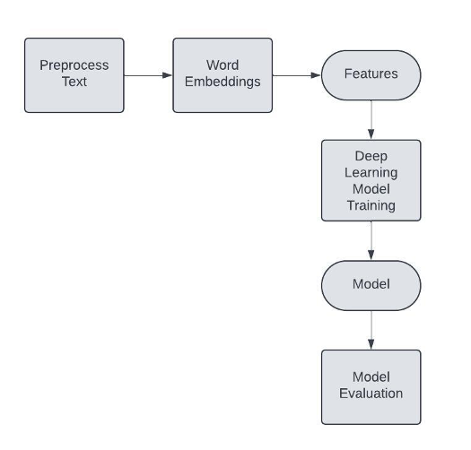
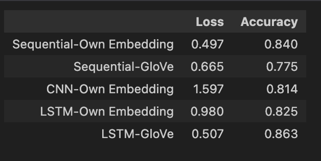
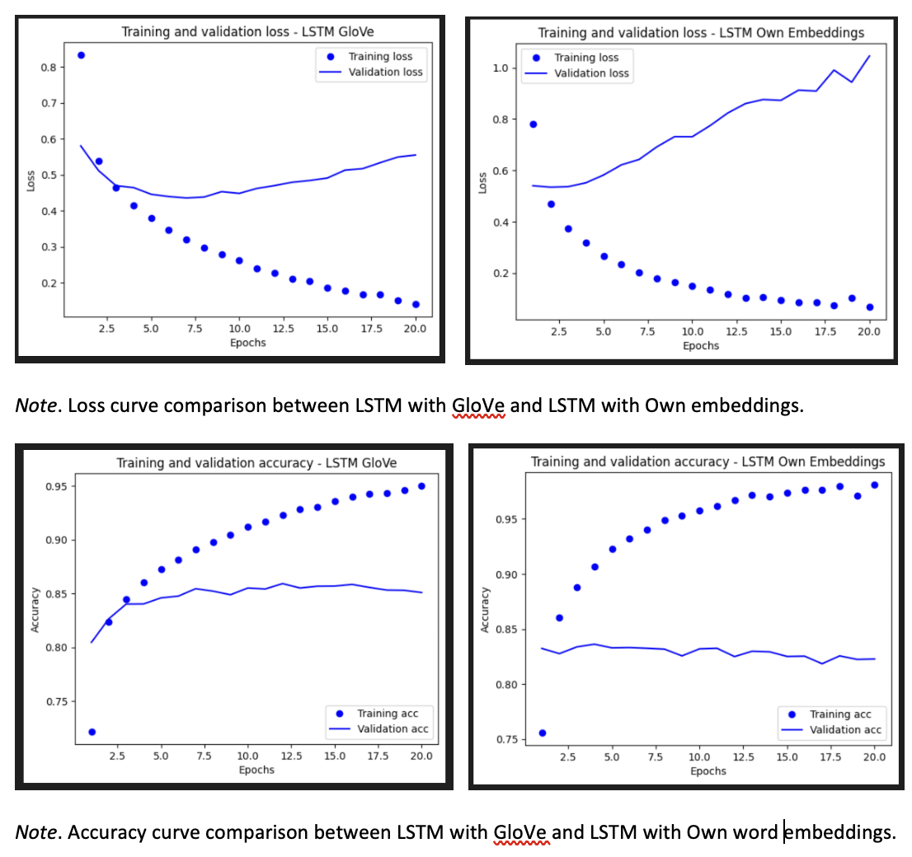
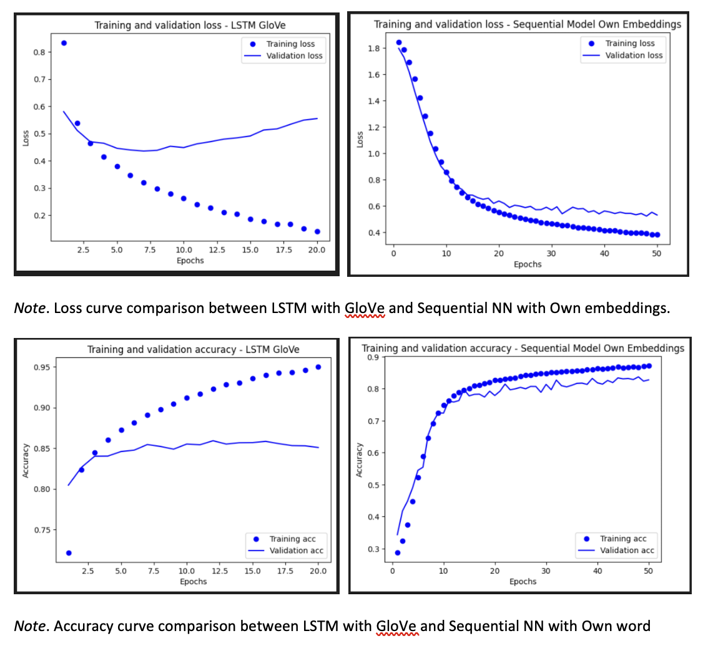

# Leveraging ML to scale Plastic Pollution Cleanup in Water Bodies

Customer service is a direct engagement and connection with customer for organization of any scale. Providing better customer support with quick resolution promote loyalty and trust among the customers which lead to more purchases. Machine Learning (ML) can help to boost customer support by various ways by such as automation, efficiency and better experiences. 

In a typical service request process flow, after a service request is placed by a customer it is processed and assigned a category. Based on the assigned category, the ticket is then forwarded to the concerned service team for further resolution. It is estimated that a large number of tickets is not correctly routed to proper service team resulting in delay, re-processing and going through multiple hops to reach the correct destination.  This causes increased resolution time which results in customer dissatisfaction and churn. When there is surge in customer service request the triage and routing step becomes a bottleneck for ticket resolution. Manual classification of tickets is slow, error-prone, inefficient and costly. Organizations can use AI and ML to correctly classify the category of service tickets based on description reducing delay while increasing customer satisfaction and efficiency.

This study will focus on how Machine Learning can be used to identify the “topic” of service ticket placed by customer by mining the text in the description of the service ticket, so that it can be automatically routed to the correct contact or service team for faster resolution.

### Datasets

The dataset identified for this study is taken from [Kaggle][1] which contains 47837 service tickets for various requests related to different areas of IT services (Kaggle, n.d.). The dataset spans across various kinds of problems faced by customer related to hardware issues, access, purchases, storage, and other categories.

[1]:https://www.kaggle.com/datasets/adisongoh/it-service-ticket-classification-dataset

### Approach

_Natural Language Processing_ (NLP) is a good approach for this study because the goal is to map unstructured text from the service ticket description into features which is used to identify the category of the ticket using text classification. _Text Classification_ is a technique of assigning one or more category to a piece of text from a range of possible categories. In this use case, there are eight categories, so this is a multiclass text classification task.
The text classification approach consist of three main steps: feature extraction from the description as word embeddings; training deep learning model for classification; finally evaluate performance of the deep learning models using metrics and learning curve. The best model can then be deployed in real world applications to perform the required task.

In any natural language processing, the raw text needs preprocessing before it can be used in building ML models. Stop words and punctuation removal were performed to clean the text comments and converted to word tokens. Word embeddings representation of the ticket descriptions served as features for the model building. Popular pre-trained word embedding models such as [GloVe][2] and also “own” word embeddings were evaluated to check better performing embeddings. Deep learning models: Sequential NN, 1D-CNN, Long Short-Term Memory (LSTM) were trained with word embedding features to classify the “ticket topic”. Accuracy and loss were used as metrics to evaluate the performance of the models. Learning curves for accuracy and loss were used to investigate “overfitting” in the models.

[2]: https://nlp.stanford.edu/projects/glove/

### Training and Validation

In order to check whether pretrained embedding or own word embedding is better for the task, a simple Sequential Neural network model was trained and evaluated two times – first with own word embedding and then with pretrained GloVe. The comparison of accuracy and loss metrics between GloVe embedding and own embedding shows that, the own embedding is performing better with higher accuracy and lower loss (Figure 4). The Sequential NN using own embedding scored 84% accuracy, while using GloVe it scored only 66.5% when evaluated against the test set.

_Comparison of Loss and Accuracy Score between Models against Test Data Set_

Based on the comparison of accuracy and loss metrics, the LSTM with GloVe pretrained embedding has highest accuracy (86%) which is close to the accuracy of the sequential neural network with own word embeddings. LSTM model with pretrained GloVe embedding has same loss as the sequential neural network (0.5). Hence, Sequential NN (own word embeddings) and LSTM (pretrained Glove) are the clear winners among all the other models.

#### Generalization Curves

A model’s performance to generalize well with unseen data can be evaluated with accuracy and loss learning curves. A compassion of generalization curves between the LSTM models shows that the LSTM with own embedding has less overfitting than the LSTM with the pretrained GloVe embeddings. The wider gap between the training and validation curves demonstrates higher overfitting.

_Generalization Curves for LSTM models_

Similarly, a comparison between sequential neural network with own embeddings and LSTM with own word embeddings shows that sequential neural network is a better model due to less overfitting, even though both the models have similar accuracy.

_Generalization Curves - LSTM and Sequential Neural Network_

### Results

Overall, the text classification results are very promising with all LSTM and Sequential Neural Network models demonstrating high accuracy and low loss. CNN-1D model is the least performing model with high loss even though it has good accuracy. LSTM with pretrained GloVe embeddings is the best performing model with highest accuracy and lowest loss. However, when investigating the overfitting, Sequential NN with own word embeddings shows better generalization with very less overfitting, even though it has a lower accuracy (84%) compared to LSTM with GloVe embeddings (86%). As, it is important for a model to generalize well outside of training data when deployed in production, a lift of 2% can be traded off for better fit. Hence, the sequential neural network with own word embeddings is a best balance between metric score and overfitting. 

### References

Kaggle. (n.d.). _IT Service Ticket Classification Dataset_. Retrieved December Feb 4, 2024, from 
**https://www.kaggle.com/datasets/adisongoh/it-service-ticket-classification-dataset**

Pennington, J., Socher, R. & Manning D, C. (2014). _GloVe: Global Vectors for Word Representation._ **https://nlp.stanford.edu/projects/glove/**

